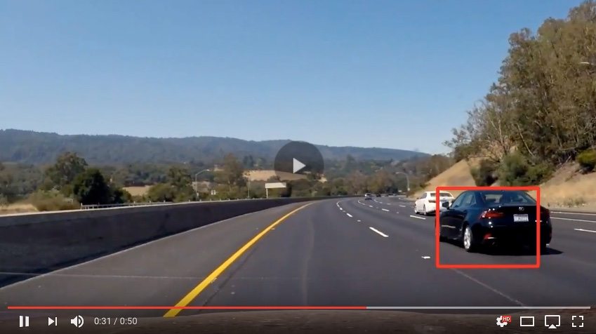

## Vehicle Detection Project ##

The goal is to create a pipeline to identify and treck vehicles in a video from a front-facing camera on a car.
I used a traditional Computer Vision approach for object detection: processing stages, feature extraction, spatial sampling and classification. Different algorithms and techniques can be applied for these stages, and the parameters for each stage are usually tuned by hand.
In comparison, a Deep Neural Network designed for object detection can perform these tasks using a complex interconnected architecture where the stages are not as distinct. Lower layers of a neural network, i.e. the ones closer to the input data, typically perform some equivalent of feature extraction, while higher layers can localize and classify simultaneously to produce detections.

---

Project steps:

* Perform a Histogram of Oriented Gradients (HOG) feature extraction on a labeled training set of images and train a classifier Linear SVM classifier
* Image processing: color transformation, binned color features, color histograms, HOG feature vector. 
* SVM features preprocessing: normalization. Randomization of a selection for training and testing data.
* Implement a sliding-window technique and use your trained classifier to search for vehicles in images.
* Run pipeline on a video stream and create a heat map of recurring detections frame by frame to reject outliers and follow detected vehicles.
* Estimate a bounding box for vehicles detected.

[//]: # (Image References)
[image1]: ./examples/HOG.png
[image2]: ./examples/heat.png
[video1]: ./project_video_out.mp4

### Histogram of Oriented Gradients (HOG)

####  HOG features extraction from the training images.

I created help functions to extract featues from images. You can find it in the `cell code 2` of the [`IPython notebook`](https://github.com/MingalievDinar/VehicleDetectionTracking/blob/master/Vehicle%20Detection%20and%20Tracking.ipynb). I have tryed different combinations of params to extract HOG features:
* Color map
* Different channels
* Cell size
* Block size
* Orientation

In the `cell 10` you can find best 5 results.
Code `cells 5-8` for Histogram and Spatial features extraction.

In the `cell 16` I selected 5 random Viechel and Non Viechel to show the results of HOG and classifier prediction.

![alt text][image1]

####  Final choice of HOG parameters.

I tried about 400 combinations of parameters `cell 9` and selected 4 of them to combine with other features to obtain the best result.

#### Classifier training.

Among all help functions you can find function `SVM_resultI()`. I trained a linear `SVM` in `cell 12` using `spatial`, `histogram` and `HOG` features. The best 10 results are in `cell 13`. I used `LAB` for `histogram` and `spatial` features and `LUV` for `HOG`. Final version of `SVM` I got at `cell 14`.
Also I tryed `GridSearchCV` but it takes too much time to tune hyperparameters and I skipped it. 

### Sliding Window Search

#### Sliding window search implementation.

In the `cell 17` you can find a code with `sliding windows` implementation. In the next `cell 18` I created more simple function with fixed parameters for convinience. I tried different scales. But a scale equals to 1.5 works the best during car detection on images. Maybe on video I can choose smaller scale because I will exclude False Positive by `thresholding heatmap`. I overlapped 75% of images - I think it is a reasonable values to have enough windows but not too much in order to speed up the process. That is why I also used not all `image channels` but only one for each feature type (784 features in total).

####  Pipeline demonstration on test images.

I have already described how I choose all features above (selected several combinations with highest accuracy for each feature and combined several features to create the final one). In `cell 19` I added functions: `heatmap`, `labels` and `threshold`. In the `cell 21` I created the `final pipline` by averaging the results of 7 heatmaps and with threshold equals to 3. Here are some example images:

![alt text][image2]

---

### Video Implementation

#### Final video output. The pipeline performs reasonably well on the entire project video.

You can see the final vidoe output on Youtube: 

The original video can be downloaded [here](./project_video_out.mp4)

#### Filter for false positives and some method for combining overlapping bounding boxes.

To avoid false positives of classifier, I recorded the positions of positive detections in each frame of the video.  From the positive detections I created a heatmap and then thresholded that map to identify vehicle positions.  Then I used `scipy.ndimage.measurements.label()` to identify individual blobs in the heatmap. I assumed that each blob corresponded to a vehicle. Finally, I constructed bounding boxes to cover the area of each blob detected.  

Above I provided examples showing the heatmap from a series of frames of video.

---

#### Problems / issues I faced.

* About 8k features for classification in similar projects, but I used only 784 to speed up the process on embedded systems. If I would use more features - most probably I will have more robsut results. On other hand more feature - higher probability of overfitting.
* I didn't 'play' with scale - combine differnt scales.
* Try not only linear kernel for SVM but also others
* Implement object detection by convolution neural networks
